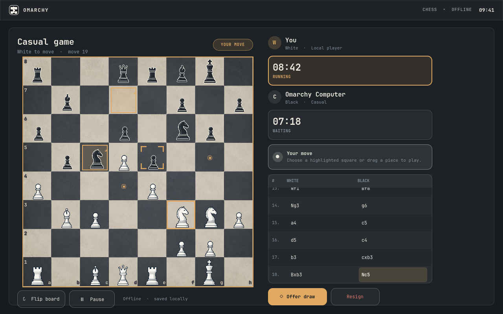

# Omarchy Chess



Play a complete game of chess against the computer or a friend without leaving Omarchy.

```bash
omarchy plugin add https://github.com/rodrix2000/omarchy-chess.git --enable
```

Built for Omarchy Quattro (Omarchy 4) with native QML. No account, API key, external engine, telemetry, runtime build, or network connection is needed after installation. [Watch the short demo](demo.mp4).

## Features

- Built-in offline computer opponent with Learner, Casual, Challenging, and Strong profiles
- Local two-player games with white, black, manual, or turn-following orientation
- Complete orthodox movement: castling, en passant, and queen/rook/bishop/knight promotion
- Checkmate, stalemate, dead positions, draw offers, claimable and automatic draw rules, resignation, and timeout adjudication
- Untimed play or 5+0, 10+5, and 15+10 clocks
- Exact autosave, pause-on-close, crash-safe recovery, undo, completed-game history, replay, and PGN export
- Click, drag, arrow-key, or Vim-style board control
- Selectable Charcoal, Green, and Ivory textured boards with persisted appearance settings
- A compact native launcher with active-game context and clear computer or two-player setup paths
- Theme-aware surfaces, optional legal-move hints, visible focus, non-color markers, reduced motion, high-contrast indicators, and optional sound
- Original modern piece artwork, reproducible icons, and generated sound assets

## Install and play

Review the repository before enabling it: Omarchy plugins run unsandboxed inside the shell with your user permissions.

1. Run the install command above.
2. Click the chess knight in the bar.
3. Choose **Play Computer** or **Local Two-Player**.
4. Select a piece and then a highlighted destination.

The computer runs in a bounded WorkerScript, off the shell UI thread. Closing the panel pauses active clocks and saves the exact position; opening it again resumes from that state.

## Controls

| Key | Action |
|---|---|
| Arrows or `H` `J` `K` `L` | Move the board cursor |
| `Enter` or `Space` | Select a piece or play the destination |
| `Esc` | Cancel the current selection or transient view |
| `F` | Flip the board |
| `U` | Request undo |
| `P` | Pause or resume |
| `D` | Open draw actions |
| `Ctrl+R` | Resign with confirmation |
| `?` or `F1` | Open help |
| `Q` `R` `B` `N` | Choose a promotion piece |
| Replay: Left/Right, Home/End | Step, first position, final position |

All destructive actions require confirmation. Legal moves, captures, check, selection, last move, and keyboard focus have shape or outline cues in addition to color.

## Privacy and data

Omarchy Chess is offline-first and contains no network or telemetry code. It stores only settings, an active game, completed records, PGN, exports, and recovery copies under:

```text
${XDG_STATE_HOME:-$HOME/.local/state}/omarchy-chess/
```

Diagnostics are bounded and omit FEN, PGN, player names, clipboard contents, and environment dumps. Copying PGN or diagnostics happens only after an explicit user action through Quickshell's native clipboard API. See the [privacy statement](docs/54_PRIVACY_STATEMENT.md) and [security policy](SECURITY.md).

## Architecture

```text
bar widget ─┐
            ├─ native panel → shared Service.qml
host shell ─┘                  ├─ rules + adjudication + clocks
                              ├─ transactional game controller
                              ├─ bounded off-thread computer search
                              └─ atomic XDG persistence + PGN history
```

`chess.js` 1.4.0 is the pinned move-legality and notation authority. Project-owned modules add repetition identity, FIDE-ordered adjudication, controller state, clocks, persistence, and AI integration. The panel never invents legal moves and the AI's returned UCI move is revalidated before commit.

## Development and verification

```bash
./scripts/validate.sh
./scripts/release-check.sh
```

The regular gate runs manifest validation, zero-warning QML lint, real Quickshell service/panel/computer/history journeys, six standard perft positions, controller and persistence tests, draw/adjudication cases, PGN/FEN/SAN round trips, and a 1,000-position seeded AI legality campaign. The release gate adds deeper perft, asset reproducibility/security checks, secret and runtime-network scans, plus clean Omarchy CLI install/update/remove/reinstall fixtures with retained state.

The release was validated on Omarchy `4.0.0-1`, Quickshell `0.3.0.r20.g28771c7`, Qt `6.11.1`, and Node `26.7.0`. End users do not need Node or Python.

## Update, disable, and remove

```bash
omarchy plugin update io.github.rodrix2000.chess
omarchy plugin disable io.github.rodrix2000.chess
omarchy plugin remove io.github.rodrix2000.chess
```

Disabling or removing the source leaves game data intact, so reinstalling a compatible version restores it. To erase all settings and games as a separate irreversible action:

```bash
rm -rf "${XDG_STATE_HOME:-$HOME/.local/state}/omarchy-chess"
```

Backup or restore the state directory while the plugin is disabled or the shell is stopped. Portable PGN copies are also available from the game and replay views.

## Known limitations

- V1 has no online play, accounts, cloud sync, variants, or chat.
- Computer levels are descriptive local profiles, not Elo ratings or a professional analysis engine.
- The first sound cue may initialize the system audio backend; gameplay continues silently if audio is unavailable.
- Rolling back to a version that does not understand a newer future state schema may require restoring a backup or using the preserved PGN.

## Credits and license

Omarchy Chess code, documentation, artwork, and generated sounds are available under the [MIT License](LICENSE). The vendored `chess.js` 1.4.0 dependency is BSD-2-Clause; its exact license, source commit, and reproducible runtime transformation are preserved in [Third-Party Notices](THIRD_PARTY_NOTICES.md). FIDE rules informed the adjudication policy; no endorsement is implied.
